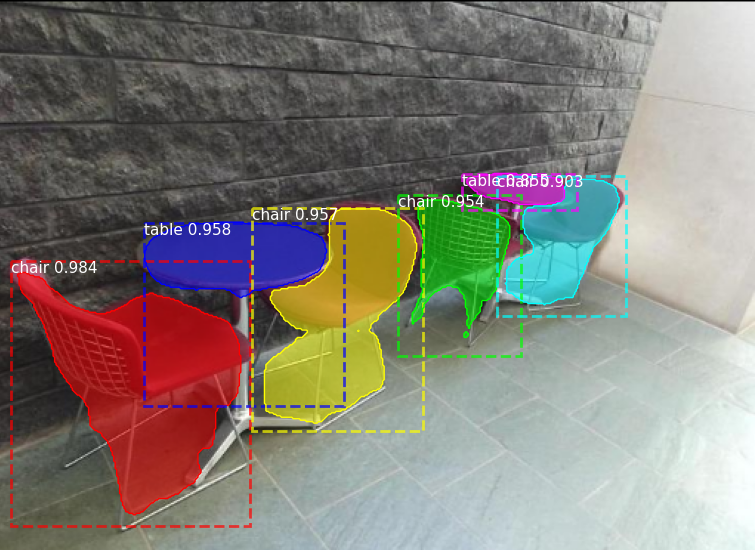
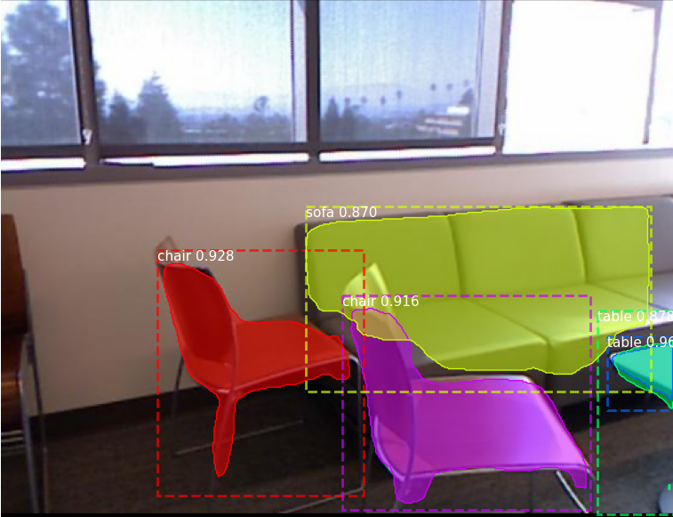
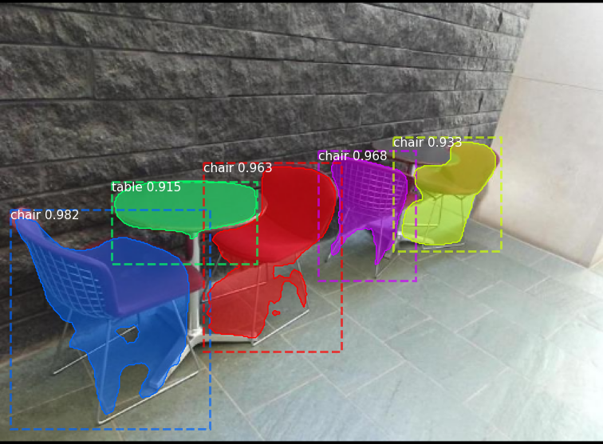
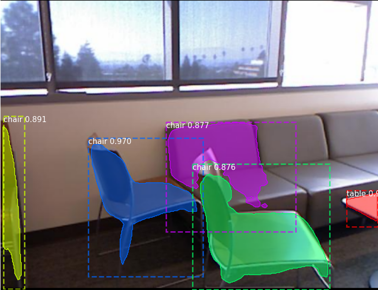

# Mask R-CNN for Object Detection and Instance Segmentation

This is an implementation of [Mask R-CNN](https://arxiv.org/abs/1703.06870) on Python 3, Keras, and TensorFlow. The model generates bounding boxes and segmentation masks for each instance of an object in the image. It's based on Feature Pyramid Network (FPN) and a ResNet101 backbone.

This repository adds functionalities to the original repo to train on rgbd data for indoor scenes. In this case the SUNRGBD dataset is used to train the model and perform instance segmentation on the following classes: 

* desk
* chair
* sofa
* bed
* bookcase

## Qualitative results

input data                 |          image 1          |         image 2
:-------------------------:|:-------------------------:|:-------------------------:
RGBD|  |  
RGB| |

# Quantitative results
Functionality to calculate those metrics out of the box are added to the evaluation command. To execute the per class evaluation, the weights must be put into the logs/reduced_classes folder and the evaluation flag must be provided when starting the sun.py script.
The weighted mAP among classes is 4.6 % higher when using rgb data what can be seen int the tables below. 

Augm. number  | Augm. strength | mAP (RGB) | mAP (RGBD) |
:-------------------------:|:-------------------------:|:-------------------------:|:-------------------------:|
0 | 0 | 0.252 | 0.264 
2 | 3 | 0.237 | 0.296 
3 | 7 | 0.226 | 0.288 

The mIoU and mAP for the best rgb and the best rgbd models for each class can be seen in the table below. 

class |          mAP best RGB | mAP best RGBD |          mIoU best RGB |  mIoU best RGBD      |  
:-------------------------:|:-------------------------:|:-------------------------:|:-------------------------:|:-------------------------:
bed | 0.331 | 0.285 | 0.351 | 0.295 
chair | 0.367 | 0.40 | 0.453 | 0.475
table | 0.258 | 0.335 | 0.316 | 0.377 
sofa | 0.132 | 0.147 | 0.183 | 0.2 
bookcase | 0.100 | 0.143 | 0.141 | 0.189